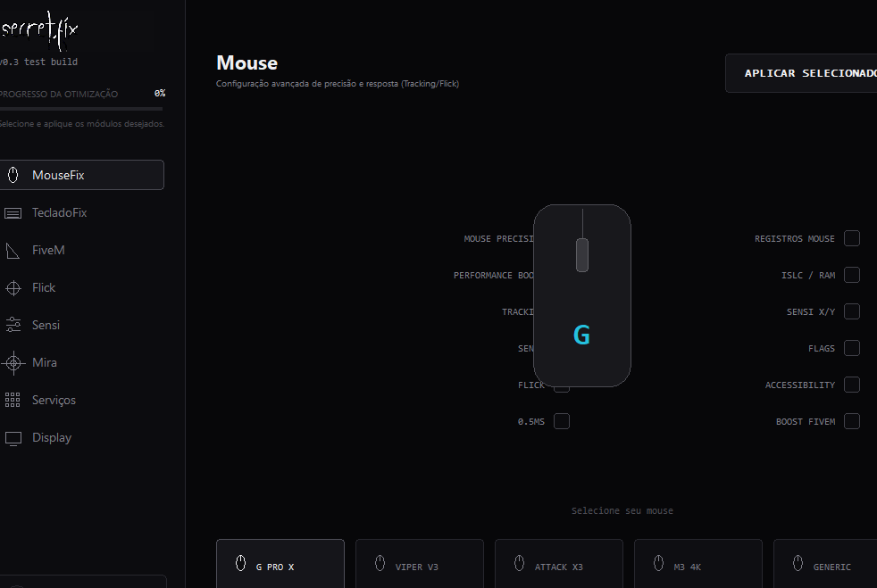

# secret.fix

[](https://github.com/Arthur-Brutty/secret.fix/actions/workflows/windows-build.yml)

`secret.fix` is a Windows desktop prototype for inspecting input devices and applying transparent, reversible input settings. It is designed as a portfolio project: the repository keeps the WPF, .NET, Win32, diagnostics, persistence, and test code available for technical review.

> Status: development prototype. The current licensing implementation is explicitly mock, development, and local-only; no production authentication or licensing backend is included.

## Why I built it

The project explores a practical desktop-tool problem: exposing Windows input configuration without hiding system changes behind vague "optimization" claims. Each supported change is intended to be observable, backed up before application, re-read for validation, and restorable.

## Main features

- Mouse and keyboard profiles backed by documented Windows settings APIs.
- HID-based device discovery with known VID/PID matching and generic fallbacks.
- Raw Input capture that measures event intervals, estimated polling frequency, jitter, and stability indicators.
- Input diagnostics, operation history, local JSON persistence, and backup/restore flows.
- A conservative FiveM launcher that locates or starts the installed executable; it does not inject code, modify game memory, or bypass anti-cheat.
- WPF/XAML UI with feature gating for the CORE, PULSE, and APEX product concepts.

## Technology stack

- C# and .NET 8
- WPF and XAML
- Win32 interoperability (`SystemParametersInfo`, Raw Input)
- HID/device discovery, JSON persistence, and async UI operations
- xUnit tests and GitHub Actions for Windows CI

## Architecture

The application keeps presentation, service orchestration, local state, and Windows interop separate. See [Architecture](docs/architecture.md) and [Technical decisions](docs/technical-decisions.md) for the design rationale.

## Precision Engine and diagnostics

The input benchmark measures timing between Raw Input mouse events. It is an input-event measurement tool, not an end-to-end latency meter, and it does not claim latency improvements without a measurement. Diagnostics expose detected devices and the current Windows input state where it can be read safely.

## Windows and FiveM integration

Mouse and keyboard changes use documented Windows APIs. Before a supported change, the application records the prior state and supports restoration. FiveM support is limited to safe process discovery and launch assistance. Injection, aim assistance, combat macros, anti-cheat bypasses, and server-rule bypasses are outside the project.

## Safety and security model

- No production secrets, private keys, master license keys, database credentials, or payment credentials belong in this repository or client binary.
- Runtime data is stored under the current user's local application data directory and is ignored by Git.
- Application logs redact credential-like values. Logs must not contain complete licenses, authorization headers, or tokens.
- A future production client would communicate with a private HTTPS backend through public DTOs/interfaces only. Server credentials and private signing keys stay on the server.

See [Security model](docs/security-model.md) and [Security policy](SECURITY.md).

## Screenshot

The archived UI reference below contains no account, license, device serial, token, or personal-path data.



## Project structure

```text
src/        WPF application, services, models/state, and Windows interop
tests/      xUnit coverage for persistence, profiles, devices, and benchmarks
docs/       Architecture, security, portfolio, product, and design notes
scripts/    Local development and Windows publishing helpers
.github/    Windows build, test, and publish-artifact workflow
```

## Build locally

Requires Windows 10/11 x64 and the .NET 8 SDK.

```powershell
dotnet restore SecretFix.sln
dotnet build SecretFix.sln -c Release --no-restore
dotnet test tests/SecretFix.Tests/SecretFix.Tests.csproj -c Release --no-restore
```

To run the application during development:

```powershell
dotnet run --project src/SecretFix.App/SecretFix.App.csproj
```

To produce a local self-contained Windows build:

```powershell
.\scripts\publish-win-x64.ps1
```

Published executables are ignored by Git. Versioned binaries belong in GitHub Actions artifacts or GitHub Releases, not in source control.

## CI/CD

The [Windows build workflow](.github/workflows/windows-build.yml) restores, builds, tests, and publishes a versioned Windows artifact on `main` pushes and pull requests. The workflow uses only read access to repository contents and does not require a secret for the current build. If signing or deployment is added later, credentials must be stored as GitHub Actions Secrets and never written to the workflow or its logs.

## Documentation for technical review

- [Architecture](docs/architecture.md)
- [Technical decisions](docs/technical-decisions.md)
- [Security model](docs/security-model.md)
- [Portfolio narrative](docs/portfolio.md)
- [Interview notes](docs/interview-notes.md)
- [Changelog](docs/CHANGELOG.md)

## Roadmap

Planned work includes a private production licensing backend, release code signing, commercial-build obfuscation where appropriate, and additional diagnostics. Those capabilities are intentionally not represented as existing features in this repository.

## License

Copyright © 2026 Arthur De Oliveira.

This repository is publicly available for portfolio and technical review. Unauthorized commercial redistribution, resale, or incorporation of this source code into third-party commercial products is not permitted. See [LICENSE](LICENSE) for details.
