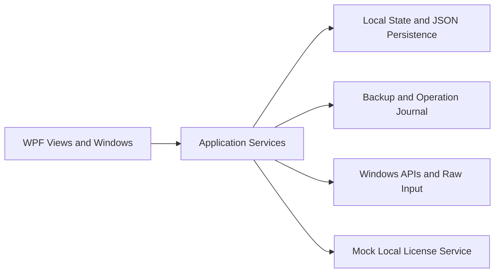

# Architecture

## Overview

`secret.fix` is a .NET 8 WPF desktop application. Presentation, application services, local state, and Windows interop are separated so persistent system changes remain reviewable.

## Presentation and services

`Views/`, windows, controls, and XAML styles form the presentation layer. Services own device detection, profiles, diagnostics, input benchmarking, backups, operation history, safe FiveM launching, and the local mock license boundary. Views do not contain direct registry or Win32 configuration logic.

## Models and persistence

`Core/` contains feature, device, plan, profile, benchmark, and operation models. `SettingsService` serializes `State/AppSettings.cs` to the current user's local application-data directory. Settings use a schema version and normalization so additive fields can be introduced without discarding older local data. Backups and operation records are local and ignored by Git.

## Windows APIs and diagnostics

`Infrastructure/Windows` wraps `SystemParametersInfoW` for supported mouse and keyboard settings. Win32 failures surface as `Win32Exception` values for the service layer. `InputBenchmarkService` registers Raw Input and observes mouse-event intervals; it does not measure display, rendering, USB-controller, or game-engine latency.

## Recovery flow

1. Read the current Windows state.
2. Write a local backup and pending-operation journal.
3. Apply only selected, supported settings.
4. Re-read state and record validation status.
5. Keep a restore path and bounded local operation history.

Unsupported tweaks are reported as unavailable rather than simulated as successful.

## Build and test

The solution targets `net8.0-windows`. xUnit tests cover device matching, persistence, backups, profile metadata, operation journaling, benchmark calculation, and log redaction. GitHub Actions restores, builds, tests, and publishes a Windows artifact without committing build output.
